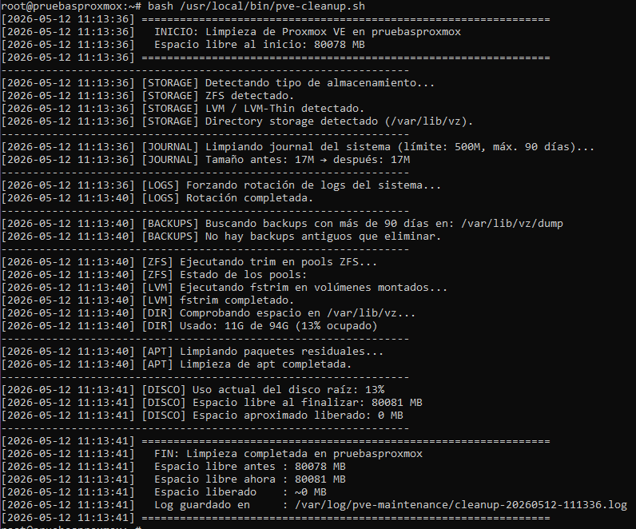
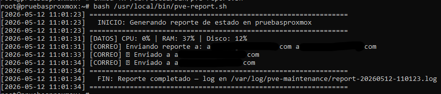
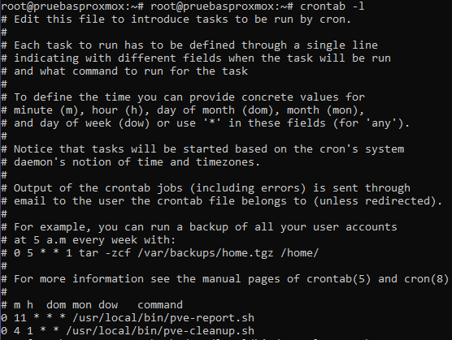

# Scripts de mantenimiento — Proxmox VE

Tres scripts para automatizar el mantenimiento de cualquier nodo Proxmox. Pensados para implantarse en entornos de clientes: toda la configuración está agrupada al principio de cada archivo para que sea fácil de adaptar.

## Estructura del repositorio

```
scripts/
├── pve-cleanup.sh
├── pve-update.sh
└── pve-report.sh
assets/
├── CAPTURA1.png
├── CAPTURA2.png
└── CAPTURA3.png
```

---

## pve-cleanup.sh — Limpieza del sistema

[📄 Ver script](scripts/pve-cleanup.sh)

Limpia el espacio acumulado en el nodo: journal del sistema, logs generales, backups antiguos y paquetes residuales de apt. Detecta automáticamente el tipo de storage (ZFS, LVM o Directory) y actúa en consecuencia.

**Qué tocar antes de usarlo:**
```bash
BACKUP_DIR="/var/lib/vz/dump"   # Ruta de los backups en este cliente
BACKUP_RETENTION_DAYS=60        # Días que se conservan los backups
JOURNAL_MAX_SIZE="500M"         # Tamaño máximo del journal
DISK_WARN_PERCENT=85            # % de disco que activa la alerta en el log
```

**Cron recomendado** — primer día de cada mes a las 04:00:
```
0 4 1 * * /usr/local/bin/pve-cleanup.sh
```

Aquí se puede ver el script detectando los tres tipos de storage (ZFS, LVM y Directory), limpiando el journal, rotando logs y dejando el resumen final con el espacio liberado:



---

## pve-update.sh — Actualización segura

[📄 Ver script](scripts/pve-update.sh)

Antes de tocar nada, hace un backup completo de todas las VMs y contenedores en el storage externo configurado. Si algún backup falla, el script se detiene y no actualiza. Si todo va bien, aplica `apt upgrade` y limpia paquetes huérfanos.

Si se ejecuta manualmente y el sistema necesita reinicio, pregunta si reiniciar ahora o más tarde. Si corre por cron, solo lo anota en el log.

**Qué tocar antes de usarlo:**
```bash
BACKUP_STORAGE="nombre-storage-externo"  # Nombre del storage en Proxmox (ver: pvesm status)
BACKUP_COMPRESS="zstd"                   # Compresión: zstd | lzo | gzip
```

**Cron recomendado** — domingos a las 03:00:
```
0 3 * * 0 /usr/local/bin/pve-update.sh
```

---

## pve-report.sh — Reporte diario por correo

[📄 Ver script](scripts/pve-report.sh)

Envía cada día un correo HTML con el estado del nodo: uso de CPU, RAM y disco con barras de progreso en verde, naranja o rojo según los umbrales. Incluye también el número de VMs y contenedores activos y los paquetes pendientes de actualización.

Requiere `msmtp` instalado en el nodo: `apt-get install -y msmtp msmtp-mta`

Para Gmail necesitas una **contraseña de aplicación** (no la contraseña normal). Se genera en: https://myaccount.google.com/apppasswords

**Qué tocar antes de usarlo:**
```bash
SMTP_USER="tu-cuenta@gmail.com"
SMTP_PASS="xxxxxxxxxxxxxxxx"      # Contraseña de aplicación de Google (16 caracteres)
MAIL_TO="usuario@empresa.com"     # Separar varias cuentas con espacios
WARN_PERCENT=85                   # Umbral para resaltar en rojo
```

**Cron recomendado** — todos los días a las 11:00:
```
0 11 * * * /usr/local/bin/pve-report.sh
```

Aquí se ve la ejecución del reporte enviándose correctamente a las cuentas configuradas:



---

## Cron configurado

Una vez instalados los tres scripts, el crontab queda así:



---

## Instalación rápida

```bash
# 1. Copiar los scripts al nodo
scp scripts/pve-cleanup.sh scripts/pve-update.sh scripts/pve-report.sh root@IP-DEL-NODO:/usr/local/bin/

# 2. Dar permisos de ejecución
chmod +x /usr/local/bin/pve-cleanup.sh
chmod +x /usr/local/bin/pve-update.sh
chmod +x /usr/local/bin/pve-report.sh

# 3. Instalar msmtp (necesario para pve-report.sh)
apt-get install -y msmtp msmtp-mta

# 4. Probar cada script manualmente antes de activar el cron
bash /usr/local/bin/pve-report.sh
bash /usr/local/bin/pve-cleanup.sh
bash /usr/local/bin/pve-update.sh

# 5. Añadir el cron
crontab -e
```

Los logs se guardan en `/var/log/pve-maintenance/` con fecha en el nombre.